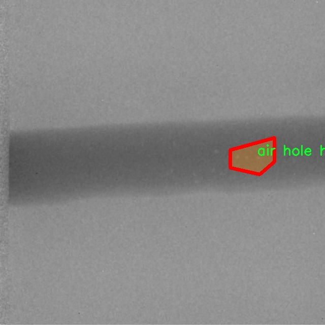

# 钢管缺陷分割系统源码＆数据集分享
 [yolov8-seg-RevCol＆yolov8-seg-EfficientHead等50+全套改进创新点发刊_一键训练教程_Web前端展示]

### 1.研究背景与意义

项目参考[ILSVRC ImageNet Large Scale Visual Recognition Challenge](https://gitee.com/YOLOv8_YOLOv11_Segmentation_Studio/projects)

项目来源[AAAI Global Al lnnovation Contest](https://kdocs.cn/l/cszuIiCKVNis)

研究背景与意义

随着工业化进程的加快，钢管作为重要的工程材料，在建筑、交通、能源等多个领域得到了广泛应用。然而，钢管在生产和使用过程中，常常会出现各种缺陷，如气孔、咬边、裂纹、重叠、夹杂物等，这些缺陷不仅影响了钢管的机械性能和使用寿命，还可能导致严重的安全隐患。因此，及时、准确地检测和分割钢管缺陷，对于保障工程质量和安全具有重要的现实意义。

传统的钢管缺陷检测方法多依赖于人工目视检查或简单的图像处理技术，这些方法不仅效率低下，而且容易受到人为因素的影响，导致漏检或误检。随着计算机视觉和深度学习技术的迅速发展，基于深度学习的缺陷检测方法逐渐成为研究热点。其中，YOLO（You Only Look Once）系列模型因其高效的实时检测能力和较高的准确率，已被广泛应用于目标检测和实例分割任务。YOLOv8作为该系列的最新版本，进一步提升了模型的性能，具备了更强的特征提取能力和更快的推理速度，为钢管缺陷的自动化检测提供了新的可能性。

本研究旨在基于改进的YOLOv8模型，构建一个高效的钢管缺陷分割系统。我们将利用一个包含3300张图像的钢管缺陷数据集，该数据集涵盖了8种不同类型的缺陷，包括气孔、咬边、裂纹、重叠、夹杂物等。这些缺陷的多样性和复杂性为模型的训练和评估提供了丰富的样本，能够有效提升模型的泛化能力和实际应用效果。通过对YOLOv8模型的改进，我们将重点优化其在小目标检测和复杂背景下的表现，以确保在实际应用中能够准确识别和分割出钢管表面的各种缺陷。

本研究的意义不仅在于推动钢管缺陷检测技术的发展，更在于为相关行业提供一种高效、可靠的解决方案。通过实现钢管缺陷的自动化检测与分割，我们能够大幅提高检测效率，降低人工成本，减少人为错误，从而有效提升钢管的生产质量和安全性。此外，研究成果还可以为其他材料的缺陷检测提供借鉴，推动更多领域的智能化进程。

综上所述，基于改进YOLOv8的钢管缺陷分割系统的研究，不仅具有重要的理论价值，还有着广泛的应用前景。通过深入探讨钢管缺陷的特征及其检测方法，我们期望能够为工业界提供切实可行的技术支持，推动钢管行业的智能化升级，为保障公共安全和促进经济发展贡献力量。

### 2.图片演示


##### 注意：由于此博客编辑较早，上面“2.图片演示”和“3.视频演示”展示的系统图片或者视频可能为老版本，新版本在老版本的基础上升级如下：（实际效果以升级的新版本为准）

  （1）适配了YOLOV8的“目标检测”模型和“实例分割”模型，通过加载相应的权重（.pt）文件即可自适应加载模型。

  （2）支持“图片识别”、“视频识别”、“摄像头实时识别”三种识别模式。

  （3）支持“图片识别”、“视频识别”、“摄像头实时识别”三种识别结果保存导出，解决手动导出（容易卡顿出现爆内存）存在的问题，识别完自动保存结果并导出到tempDir中。

  （4）支持Web前端系统中的标题、背景图等自定义修改，后面提供修改教程。

  另外本项目提供训练的数据集和训练教程,暂不提供权重文件（best.pt）,需要您按照教程进行训练后实现图片演示和Web前端界面演示的效果。

### 3.视频演示

[3.1 视频演示](https://www.bilibili.com/video/BV1pr2UYAEa9/)

### 4.数据集信息展示

##### 4.1 本项目数据集详细数据（类别数＆类别名）

nc: 8
names: ['air hole hollow', 'air hole', 'bite edge', 'broken arc', 'crack', 'overlap', 'slag inclusion', 'unfused']


##### 4.2 本项目数据集信息介绍

数据集信息展示

在现代工业生产中，钢管的质量直接影响到其在各类工程中的应用安全性与可靠性。因此，针对钢管缺陷的检测与分割显得尤为重要。本研究旨在通过改进YOLOv8-seg模型，构建一个高效的钢管缺陷分割系统，以提高钢管缺陷检测的准确性和效率。为此，我们使用了名为“steel tube instance seg”的数据集，该数据集专门用于训练和评估钢管缺陷分割任务。

“steel tube instance seg”数据集包含了多种类型的钢管缺陷，具体包括八个类别，分别是：气孔空洞（air hole hollow）、气孔（air hole）、边缘咬合（bite edge）、断弧（broken arc）、裂纹（crack）、重叠（overlap）、夹杂物（slag inclusion）和未熔合（unfused）。这些缺陷在钢管的生产和使用过程中可能会导致严重的结构问题，因此对其进行准确的识别和分割是至关重要的。

在数据集的构建过程中，研究团队对每种缺陷进行了详细的标注和分类，以确保模型在训练过程中能够获得丰富的特征信息。每个类别的样本均经过精心挑选，涵盖了不同类型和程度的缺陷，从而提高了模型的泛化能力。通过这种方式，数据集不仅能够提供丰富的训练样本，还能有效地模拟实际生产中可能遇到的各种缺陷情况。

数据集的设计还考虑到了不同缺陷之间的相似性和差异性。例如，气孔和气孔空洞在外观上可能有一定的相似性，但它们的成因和对钢管性能的影响却截然不同。因此，在标注过程中，研究人员特别注重这些细微差别，以确保模型能够在实际应用中准确区分不同类型的缺陷。

此外，为了增强模型的鲁棒性，数据集中还包含了不同光照条件、视角和背景下的钢管图像。这种多样性不仅有助于提高模型的训练效果，还能使其在面对真实世界中复杂的检测环境时，依然保持较高的准确率和稳定性。

在数据集的使用过程中，研究团队将采用数据增强技术，以进一步提升模型的性能。通过对图像进行旋转、缩放、翻转等操作，增加样本的多样性，从而有效地减少过拟合现象，提高模型在新样本上的表现能力。

总之，“steel tube instance seg”数据集为改进YOLOv8-seg的钢管缺陷分割系统提供了坚实的基础。通过对八种缺陷的详细标注和多样化的样本设计，该数据集不仅为模型的训练提供了丰富的特征信息，也为后续的模型评估和应用奠定了良好的基础。随着研究的深入，我们期待这一系统能够在实际生产中发挥重要作用，为钢管的质量控制和安全检测提供强有力的技术支持。




### 5.全套项目环境部署视频教程（零基础手把手教学）

[5.1 环境部署教程链接（零基础手把手教学）](https://www.bilibili.com/video/BV1jG4Ve4E9t/?vd_source=bc9aec86d164b67a7004b996143742dc)


[5.2 安装Python虚拟环境创建和依赖库安装视频教程链接（零基础手把手教学）](https://www.bilibili.com/video/BV1nA4VeYEze/?vd_source=bc9aec86d164b67a7004b996143742dc)

### 6.手把手YOLOV8-seg训练视频教程（零基础小白有手就能学会）

[6.1 手把手YOLOV8-seg训练视频教程（零基础小白有手就能学会）](https://www.bilibili.com/video/BV1cA4VeYETe/?vd_source=bc9aec86d164b67a7004b996143742dc)


按照上面的训练视频教程链接加载项目提供的数据集，运行train.py即可开始训练



     Epoch   gpu_mem       box       obj       cls    labels  img_size
     1/200     0G   0.01576   0.01955  0.007536        22      1280: 100%|██████████| 849/849 [14:42<00:00,  1.04s/it]
               Class     Images     Labels          P          R     mAP@.5 mAP@.5:.95: 100%|██████████| 213/213 [01:14<00:00,  2.87it/s]
                 all       3395      17314      0.994      0.957      0.0957      0.0843

     Epoch   gpu_mem       box       obj       cls    labels  img_size
     2/200     0G   0.01578   0.01923  0.007006        22      1280: 100%|██████████| 849/849 [14:44<00:00,  1.04s/it]
               Class     Images     Labels          P          R     mAP@.5 mAP@.5:.95: 100%|██████████| 213/213 [01:12<00:00,  2.95it/s]
                 all       3395      17314      0.996      0.956      0.0957      0.0845

     Epoch   gpu_mem       box       obj       cls    labels  img_size
     3/200     0G   0.01561    0.0191  0.006895        27      1280: 100%|██████████| 849/849 [10:56<00:00,  1.29it/s]
               Class     Images     Labels          P          R     mAP@.5 mAP@.5:.95: 100%|███████   | 187/213 [00:52<00:00,  4.04it/s]
                 all       3395      17314      0.996      0.957      0.0957      0.0845


### 7.50+种全套YOLOV8-seg创新点代码加载调参视频教程（一键加载写好的改进模型的配置文件）

[7.1 50+种全套YOLOV8-seg创新点代码加载调参视频教程（一键加载写好的改进模型的配置文件）](https://www.bilibili.com/video/BV1Hw4VePEXv/?vd_source=bc9aec86d164b67a7004b996143742dc)

### 8.YOLOV8-seg图像分割算法原理

原始YOLOV8-seg算法原理

YOLOv8-seg是Ultralytics公司在2023年推出的YOLO系列最新版本，标志着目标检测和图像分割领域的一次重要进步。该算法在YOLOv5和YOLOv7的基础上进行了多项创新和改进，尤其是在模型结构、特征提取和损失函数设计等方面。YOLOv8-seg的核心理念是通过高效的特征提取和精确的目标定位，提升目标检测和分割的性能，同时保持计算效率。

YOLOv8-seg的网络结构分为多个模块，包括输入层、主干网络（Backbone）、颈部网络（Neck）和头部网络（Head）。在输入层，YOLOv8-seg采用了640x640的默认输入尺寸，但在实际应用中，模型能够自适应地处理不同长宽比的图像。通过自适应缩放，YOLOv8-seg在保持图像信息完整性的同时，最大限度地减少了填充带来的信息冗余。此外，YOLOv8-seg引入了Mosaic数据增强技术，通过将四张不同的图像随机拼接成一张新图像，增加了训练样本的多样性，提升了模型的泛化能力。

在主干网络部分，YOLOv8-seg对YOLOv5中的C3模块进行了替换，采用了C2f模块。这一模块的设计灵感来源于CSPNet，能够有效地提取特征并增强梯度流。C2f模块通过并行化多个梯度流分支，确保了在轻量化的同时获得更丰富的特征信息，从而提升了模型的精度和响应速度。与以往的模型相比，C2f模块的引入使得YOLOv8-seg在特征提取的效率和效果上都得到了显著提升。

颈部网络采用了PAN-FPN结构，这一结构的设计目的是实现多尺度特征的融合。通过对不同层次的特征进行有效的上采样和连接，YOLOv8-seg能够更好地捕捉到目标的细节信息，尤其是在处理小目标时表现出色。PAN-FPN结构的引入，使得YOLOv8-seg在特征融合方面更加灵活和高效，能够适应各种复杂场景下的目标检测需求。

在头部网络方面，YOLOv8-seg最大的创新在于将Coupled-Head（耦合头）结构转变为Decoupled-Head（解耦头）结构。传统的耦合头结构将目标检测和分类任务合并在同一个卷积层中，而YOLOv8-seg则将这两个任务分开处理。通过使用两个独立的卷积模块，YOLOv8-seg能够分别对目标的类别和边界框进行预测，这种解耦设计显著提高了模型的准确性和稳定性。此外，YOLOv8-seg在损失函数的设计上也进行了创新，采用了Distribution Focal Loss（DFL）和CIoU Loss相结合的方式，旨在加速模型对目标位置的聚焦，提高预测的精度。

YOLOv8-seg的另一个重要特征是其Anchor-Free的检测方式。传统的YOLO模型依赖于预设的锚框来进行目标检测，这种方法在处理不同尺寸和形状的目标时往往显得不够灵活。YOLOv8-seg通过将目标检测转化为关键点检测，避免了对锚框的依赖，简化了模型的结构，提升了泛化能力。这一创新使得YOLOv8-seg在面对多样化的目标时，能够更加高效地进行检测和分割。

总的来说，YOLOv8-seg算法通过对网络结构的优化、特征提取的增强以及损失函数的创新，达到了更高的目标检测和分割性能。其自适应输入处理、Mosaic数据增强、C2f模块、PAN-FPN结构、解耦头设计以及Anchor-Free检测方式等一系列创新，使得YOLOv8-seg在目标检测领域中展现出了强大的能力和广泛的应用前景。随着YOLOv8-seg的不断发展和完善，预计将在智能监控、自动驾驶、医疗影像分析等多个领域发挥重要作用。


### 9.系统功能展示（检测对象为举例，实际内容以本项目数据集为准）

图9.1.系统支持检测结果表格显示

  图9.2.系统支持置信度和IOU阈值手动调节

  图9.3.系统支持自定义加载权重文件best.pt(需要你通过步骤5中训练获得)

  图9.4.系统支持摄像头实时识别

  图9.5.系统支持图片识别

  图9.6.系统支持视频识别

  图9.7.系统支持识别结果文件自动保存

  图9.8.系统支持Excel导出检测结果数据


### 10.50+种全套YOLOV8-seg创新点原理讲解（非科班也可以轻松写刊发刊，V11版本正在科研待更新）

#### 10.1 由于篇幅限制，每个创新点的具体原理讲解就不一一展开，具体见下列网址中的创新点对应子项目的技术原理博客网址【Blog】：


[10.1 50+种全套YOLOV8-seg创新点原理讲解链接](https://gitee.com/qunmasj/good)

#### 10.2 部分改进模块原理讲解(完整的改进原理见上图和技术博客链接)【如果此小节的图加载失败可以通过CSDN或者Github搜索该博客的标题访问原始博客，原始博客图片显示正常】

### YOLOv8简介
继YOLOv5之后,Ultralytics公司在2023年1月发布了YOLOv8,该版本可以用于执行目标检测、实例分割和图像分类任务。整个网络结构由4部分组成:输入图像, Backbone主干网络获得图像的特征图, Head检测头预测目标对象和位置, Neck融合不同层的特征并将图像特征传递到预测层。
1)相比于YOLOv5和 YOLOv7算法,YOLOv8在训练时间和检测精度上得到极大提升,而且模型的权重文件只有6 MB,可以部署到任一嵌入式设备中,它凭借自身快速、高效的性能可以很好地满足实时检测的需求。
2)由于YOLOv8算法是YOLOv5的继承版本，对应提供了N、S、 M、L、X 等不同尺度的模型,用于满足不同场景的需求,在精度得到大幅提升的同时,能流畅地训练,并且能安装在各种硬件平台上运行。
3)在输入端,YOLOv8算法使用了Mosaic数据增强[15]、自适应锚框计算[16]等方法。Mosaic数据增强是通过随机缩放、随机裁剪、随机排布的方式进行拼接,丰富检测数据集。自适应锚框计算是网络在初始锚框的基础上输出预测框,通过差值计算、反向更新等操作计算出最佳锚框值。
4)在输出端,YOLOv8算法使用解耦头替换了以往的耦合头,将分类和回归解耦为两个独立的分支,通过解耦使各个任务更加专注,从而解决复杂场景下定位不准及分类错误的问题。


### OREPA：在线卷积重参数化
卷积神经网络(CNNs)已经在许多计算机视觉任务的应用成功，包括图像分类、目标检测、语义分割等。精度和模型效率之间的权衡也已被广泛讨论。

一般来说，一个精度较高的模型通常需要一个更复杂的块，一个更宽或更深的结构。然而，这样的模型总是太重，无法部署，特别是在硬件性能有限、需要实时推理的场景下。考虑到效率，更小、更紧凑和更快的模型自然是首选。

为了获得一个部署友好且高精度的模型，有研究者提出了基于结构重参数化的方法来释放性能。在这些方法中，模型在训练阶段和推理阶段有不同的结构。具体来说，使用复杂的训练阶段拓扑，即重参数化的块，来提高性能。训练结束后，通过等效变换将一个复杂的块重参为成一个单一的线性层。重参后的模型通常具有一个整洁架构模型，例如，通常是一个类似VGG的或一个类似ResNet的结构。从这个角度来看，重参化策略可以在不引入额外的推理时间成本的情况下提高模型的性能。


BN层是重构模型的关键组成部分。在一个重新解析块(图1(b))中，在每个卷积层之后立即添加一个BN层。可以观察到，去除这些BN层会导致的性能退化。然而，当考虑到效率时，这种BN层的使用出乎意料地在训练阶段带来了巨大的计算开销。在推理阶段，复杂的块可以被压缩成一个卷积层。但是，在训练过程中，BN层是非线性的，也就是说，它们将特征映射除以它的标准差，这就阻止了合并整个块。因此，存在大量的中间计算操作(large FLOPS)和缓冲特征映射(high memory usage)。更糟糕的是，这么高的训练预算使得很难探索更复杂和可能更强的重参块。很自然地，下面的问题就出现了：

为什么标准化在重参中这么重要？

通过分析和实验，作者认为BN层中的尺度因子最重要，因为它们能够使不同分支的优化方向多样化。

基于观察结果，作者提出了在线重参化(OREPA)(图1(c))，这是一个两阶段的pipeline，使之能够简化复杂的training-time re-param block。

在第一阶段，block linearization，去除所有的非线性BN层，并引入线性缩放层。这些层与BN层具有相似的性质，因此它们使不同分支的优化多样化。此外，这些层都是线性的，可以在训练过程中合并成卷积层。

第二阶段，block squeezing，将复杂的线性块简化为单一的卷积层。OREPA通过减少由中间计算层引起的计算和存储开销，显著降低了训练成本，对性能只有非常小的影响。

此外，高效化使得探索更复杂的重参化拓扑成为可能。为了验证这一点，作者进一步提出了几个重参化的组件，以获得更好的性能。

在ImageNet分类任务上评估了所提出的OREPA。与最先进的修复模型相比，OREPA将额外的训练时间GPU内存成本降低了65%到75%，并将训练过程加快了1.5-2.3倍。同时，OREPA-ResNet和OREPA-VGG的性能始终优于+0.2%∼+0.6%之前的DBB和RepVGG方法。同时作者还评估了在下游任务上的OREPA，即目标检测和语义分割。作者发现OREPA可以在这些任务上也可以带来性能的提高。

提出了在线卷积重参化(OREPA)策略，这极大地提高了重参化模型的训练效率，并使探索更强的重参化块成为可能；

通过对重参化模型工作机制的分析，用引入的线性尺度层代替BN层，这仍然提供了不同的优化方向，并保持了表示能力;

在各种视觉任务上的实验表明，OREPA在准确性和训练效率方面都优于以前的重参化模型(DBB/RepVGG)。


#### 结构重参化
结构重参化最近被重视并应用于许多计算机视觉任务，如紧凑模型设计、架构搜索和剪枝。重参化意味着不同的架构可以通过参数的等价转换来相互转换。例如，1×1卷积的一个分支和3×3卷积的一个分支，可以转移到3×3卷积的单个分支中。在训练阶段，设计了多分支和多层拓扑来取代普通的线性层(如conv或全连接层)来增强模型。Cao等讨论了如何在训练过程中合并深度可分离卷积核。然后在推理过程中，将训练时间的复杂模型转移到简单模型中，以便于更快的推理。

在受益于复杂的training-time拓扑，同时，当前的重参化方法训练使用不可忽略的额外计算成本。当块变得更复杂以变得更强的表示时，GPU内存利用率和训练时间将会越来越长，最终走向不可接受。与以往的重参化方法不同，本文更多地关注训练成本。提出了一种通用的在线卷积重参化策略，使training-time的结构重参化成为可能。


#### Normalization
BN被提出来缓解训练非常深度神经网络时的梯度消失问题。人们认为BN层是非常重要的，因为它们平滑了损失。最近关于无BN神经网络的研究声称，BN层并不是不可或缺的。通过良好的初始化和适当的正则化，可以优雅地去除BN层。

对于重参化模型，作者认为重参化块中的BN层是关键的。无BN的变体将会出现性能下降。然而，BN层是非线性的，也就是说，它们将特征图除以它的标准差，这阻止了在线合并块。为了使在线重参化可行，作者去掉了重参块中的所有BN层，并引入了BN层的线性替代方法，即线性缩放层。

#### 卷积分解
标准卷积层计算比较密集，导致大的FLOPs和参数量。因此，卷积分解方法被提出，并广泛应用于移动设备的轻量化模型中。重参化方法也可以看作是卷积分解的某种形式，但它更倾向于更复杂的拓扑结构。本文的方法的不同之处在于，在kernel-level上分解卷积，而不是在structure level。

#### 在线重参化
在本节中，首先，分析了关键组件，即重参化模型中的BN层，在此基础上提出了在线重参化(OREPA)，旨在大大减少再参数化模型的训练时间预算。OREPA能够将复杂的训练时间块简化为一个卷积层，并保持了较高的精度。

OREPA的整体pipeline如图所示，它包括一个Block Linearization阶段和一个Block Squeezing阶段。


参考该博客通过分析多层和多分支结构的优化多样性，深入研究了重参化的有效性，并证明了所提出的线性缩放层和BN层具有相似的效果。

最后，随着训练预算的减少，进一步探索了更多的组件，以实现更强的重参化模型，成本略有增加。

#### 重参化中的Normalization
作者认为中间BN层是重参化过程中多层和多分支结构的关键组成部分。以SoTA模型DBB和RepVGG为例，去除这些层会导致严重的性能下降，如表1所示。


这种观察结果也得到了Ding等人的实验支持。因此，作者认为中间的BN层对于重参化模型的性能是必不可少的。

然而，中间BN层的使用带来了更高的训练预算。作者注意到，在推理阶段，重参化块中的所有中间操作都是线性的，因此可以合并成一个卷积层，从而形成一个简单的结构。

但在训练过程中，BN层是非线性的，即它们将特征映射除以其标准差。因此，中间操作应该单独计算，这将导致更高的计算和内存成本。更糟糕的是，如此高的成本将阻止探索更强大的训练模块。

#### Block Linearization
如3.1中所述，中间的BN层阻止了在训练过程中合并单独的层。然而，由于性能问题，直接删除它们并不简单。为了解决这一困境，作者引入了channel级线性尺度操作作为BN的线性替代方法。

缩放层包含一个可学习的向量，它在通道维度中缩放特征映射。线性缩放层具有与BN层相似的效果，它们都促进多分支向不同的方向进行优化，这是重参化时性能提高的关键。除了对性能的影响外，线性缩放层还可以在训练过程中进行合并，使在线重参化成为可能。


基于线性缩放层，作者修改了重参化块，如图所示。具体来说，块的线性化阶段由以下3个步骤组成：

首先，删除了所有的非线性层，即重参化块中的BN层

其次，为了保持优化的多样性，在每个分支的末尾添加了一个缩放层，这是BN的线性替代方法

最后，为了稳定训练过程，在所有分支的添加后添加一个BN层。

一旦完成线性化阶段，在重参化块中只存在线性层，这意味着可以在训练阶段合并块中的所有组件。

#### Block Squeezing
Block Squeezing步骤将计算和内存昂贵的中间特征映射上的操作转换为更经济的kernel上的操作。这意味着在计算和内存方面从减少到，其中、是特征图和卷积核的空间尺寸。

一般来说，无论线性重参化块是多么复杂，以下2个属性始终成立：

Block中的所有线性层，例如深度卷积、平均池化和所提出的线性缩放，都可以用带有相应参数的退化卷积层来表示;

Block可以由一系列并行分支表示，每个分支由一系列卷积层组成。

有了上述两个特性，如果可以将

多层（即顺序结构）

多分支（即并行结构）

简化为单一卷积，就可以压缩一个块。在下面的部分中，将展示如何简化顺序结构(图(a))和并行结构(图(b))。


### 11.项目核心源码讲解（再也不用担心看不懂代码逻辑）

#### 11.1 ultralytics\models\yolo\detect\train.py

以下是经过简化和注释的核心代码部分，主要集中在 YOLO 检测模型的训练过程中。

```python
# 导入必要的库
from copy import copy
import numpy as np
from ultralytics.data import build_dataloader, build_yolo_dataset
from ultralytics.engine.trainer import BaseTrainer
from ultralytics.models import yolo
from ultralytics.nn.tasks import DetectionModel
from ultralytics.utils import LOGGER, RANK
from ultralytics.utils.torch_utils import de_parallel, torch_distributed_zero_first

class DetectionTrainer(BaseTrainer):
    """
    DetectionTrainer 类用于基于检测模型进行训练。
    """

    def build_dataset(self, img_path, mode='train', batch=None):
        """
        构建 YOLO 数据集。

        参数:
            img_path (str): 包含图像的文件夹路径。
            mode (str): 模式 ('train' 或 'val')，用户可以为每种模式自定义不同的增强。
            batch (int, optional): 批量大小，仅用于 'rect' 模式。默认为 None。
        """
        # 获取模型的最大步幅，确保步幅不小于 32
        gs = max(int(de_parallel(self.model).stride.max() if self.model else 0), 32)
        # 构建并返回 YOLO 数据集
        return build_yolo_dataset(self.args, img_path, batch, self.data, mode=mode, rect=mode == 'val', stride=gs)

    def get_dataloader(self, dataset_path, batch_size=16, rank=0, mode='train'):
        """构造并返回数据加载器。"""
        assert mode in ['train', 'val']  # 确保模式有效
        with torch_distributed_zero_first(rank):  # 仅在 DDP 时初始化数据集 *.cache
            dataset = self.build_dataset(dataset_path, mode, batch_size)
        shuffle = mode == 'train'  # 训练模式下打乱数据
        if getattr(dataset, 'rect', False) and shuffle:
            LOGGER.warning("WARNING ⚠️ 'rect=True' 与 DataLoader 的 shuffle 不兼容，设置 shuffle=False")
            shuffle = False
        workers = self.args.workers if mode == 'train' else self.args.workers * 2  # 设置工作线程数
        return build_dataloader(dataset, batch_size, workers, shuffle, rank)  # 返回数据加载器

    def preprocess_batch(self, batch):
        """对图像批次进行预处理，缩放并转换为浮点数。"""
        batch['img'] = batch['img'].to(self.device, non_blocking=True).float() / 255  # 归一化图像
        return batch

    def set_model_attributes(self):
        """设置模型的属性，如类别数量和名称。"""
        self.model.nc = self.data['nc']  # 将类别数量附加到模型
        self.model.names = self.data['names']  # 将类别名称附加到模型
        self.model.args = self.args  # 将超参数附加到模型

    def get_model(self, cfg=None, weights=None, verbose=True):
        """返回 YOLO 检测模型。"""
        model = DetectionModel(cfg, nc=self.data['nc'], verbose=verbose and RANK == -1)  # 创建检测模型
        if weights:
            model.load(weights)  # 加载权重
        return model

    def get_validator(self):
        """返回 YOLO 模型验证器。"""
        self.loss_names = 'box_loss', 'cls_loss', 'dfl_loss'  # 定义损失名称
        return yolo.detect.DetectionValidator(self.test_loader, save_dir=self.save_dir, args=copy(self.args))

    def label_loss_items(self, loss_items=None, prefix='train'):
        """
        返回带标签的训练损失项字典。

        对于分类不需要，但对于分割和检测是必要的。
        """
        keys = [f'{prefix}/{x}' for x in self.loss_names]  # 创建损失项的键
        if loss_items is not None:
            loss_items = [round(float(x), 5) for x in loss_items]  # 将张量转换为保留 5 位小数的浮点数
            return dict(zip(keys, loss_items))  # 返回损失项字典
        else:
            return keys

    def plot_training_samples(self, batch, ni):
        """绘制带有注释的训练样本。"""
        plot_images(images=batch['img'],
                    batch_idx=batch['batch_idx'],
                    cls=batch['cls'].squeeze(-1),
                    bboxes=batch['bboxes'],
                    paths=batch['im_file'],
                    fname=self.save_dir / f'train_batch{ni}.jpg',
                    on_plot=self.on_plot)

    def plot_metrics(self):
        """从 CSV 文件绘制指标。"""
        plot_results(file=self.csv, on_plot=self.on_plot)  # 保存结果图像
```

### 代码核心部分说明：
1. **数据集构建**：`build_dataset` 方法用于根据输入路径和模式构建 YOLO 数据集，支持训练和验证模式。
2. **数据加载器**：`get_dataloader` 方法创建数据加载器，处理数据的打乱和多线程加载。
3. **图像预处理**：`preprocess_batch` 方法对输入图像进行归一化处理。
4. **模型设置**：`set_model_attributes` 方法将类别数量和名称等属性设置到模型中。
5. **模型获取**：`get_model` 方法用于创建并返回 YOLO 检测模型。
6. **损失项标签**：`label_loss_items` 方法用于返回带有损失项标签的字典，便于监控训练过程中的损失情况。
7. **可视化**：`plot_training_samples` 和 `plot_metrics` 方法用于可视化训练样本和训练指标，帮助分析模型性能。

这个文件是Ultralytics YOLO模型的训练模块，主要用于目标检测任务。文件中定义了一个名为`DetectionTrainer`的类，它继承自`BaseTrainer`类，专门用于基于YOLO模型的训练。

在这个类中，首先定义了`build_dataset`方法，用于构建YOLO数据集。该方法接收图像路径、模式（训练或验证）和批量大小作为参数。它会根据模型的步幅（stride）来确定图像的处理方式，并调用`build_yolo_dataset`函数来创建数据集。

接下来是`get_dataloader`方法，它用于构建并返回数据加载器。该方法确保在分布式训练时只初始化一次数据集，并根据模式决定是否打乱数据。它还会根据训练或验证模式设置工作线程的数量。

`preprocess_batch`方法用于对一批图像进行预处理，包括将图像转换为浮点数并缩放到0到1之间。

`set_model_attributes`方法用于设置模型的属性，包括类别数量和类别名称等信息，以便模型能够正确识别和处理数据。

`get_model`方法返回一个YOLO检测模型，并可以选择加载预训练权重。

`get_validator`方法返回一个用于YOLO模型验证的`DetectionValidator`实例，记录损失名称以便后续使用。

`label_loss_items`方法用于返回带有标签的训练损失项字典，适用于目标检测和分割任务。

`progress_string`方法返回一个格式化的字符串，显示训练进度，包括当前的epoch、GPU内存使用情况、损失值、实例数量和图像大小。

`plot_training_samples`方法用于绘制训练样本及其注释，以便可视化训练过程中的数据。

最后，`plot_metrics`和`plot_training_labels`方法分别用于绘制训练过程中的指标和创建带标签的训练图，以便于分析模型的性能。

整体来看，这个文件实现了YOLO模型的训练流程，包括数据集构建、数据加载、模型设置、损失计算和可视化等功能，为目标检测任务提供了完整的训练框架。

#### 11.2 ultralytics\utils\files.py

以下是经过简化和注释的核心代码部分：

```python
import os
from pathlib import Path
from datetime import datetime

def increment_path(path, exist_ok=False, sep='', mkdir=False):
    """
    增加文件或目录路径的版本号，例如将 'runs/exp' 增加为 'runs/exp_2', 'runs/exp_3' 等。

    参数:
        path (str, pathlib.Path): 要增加的路径。
        exist_ok (bool, optional): 如果为 True，则返回原路径而不增加版本号。默认为 False。
        sep (str, optional): 路径和版本号之间的分隔符。默认为 ''。
        mkdir (bool, optional): 如果路径不存在，则创建目录。默认为 False。

    返回:
        (pathlib.Path): 增加版本号后的路径。
    """
    path = Path(path)  # 将路径转换为 Path 对象
    if path.exists() and not exist_ok:
        # 如果路径存在且 exist_ok 为 False，则增加版本号
        path, suffix = (path.with_suffix(''), path.suffix) if path.is_file() else (path, '')

        # 尝试从 2 开始增加版本号，直到找到一个不存在的路径
        for n in range(2, 9999):
            p = f'{path}{sep}{n}{suffix}'  # 构造新的路径
            if not os.path.exists(p):  # 如果新路径不存在
                break
        path = Path(p)  # 更新路径为新的路径

    if mkdir:
        path.mkdir(parents=True, exist_ok=True)  # 如果 mkdir 为 True，则创建目录

    return path  # 返回增加版本号后的路径


def file_age(path):
    """返回文件自上次更新以来的天数。"""
    dt = (datetime.now() - datetime.fromtimestamp(Path(path).stat().st_mtime))  # 计算时间差
    return dt.days  # 返回天数


def file_size(path):
    """返回文件或目录的大小（MB）。"""
    if isinstance(path, (str, Path)):
        mb = 1 << 20  # 将字节转换为 MB
        path = Path(path)
        if path.is_file():
            return path.stat().st_size / mb  # 返回文件大小
        elif path.is_dir():
            # 返回目录中所有文件的总大小
            return sum(f.stat().st_size for f in path.glob('**/*') if f.is_file()) / mb
    return 0.0  # 如果路径无效，返回 0.0
```

### 代码说明：
1. **increment_path**: 该函数用于增加文件或目录的版本号。如果指定的路径已经存在，则会在路径后面添加一个数字后缀，直到找到一个不存在的路径。如果 `mkdir` 参数为 True，则会在路径不存在时创建该目录。

2. **file_age**: 该函数计算并返回文件自上次修改以来的天数。

3. **file_size**: 该函数返回指定文件或目录的大小（以 MB 为单位）。如果是文件，直接返回文件大小；如果是目录，则计算目录中所有文件的总大小。

这个程序文件是Ultralytics YOLO项目中的一个工具模块，主要用于处理文件和目录的操作。文件中定义了一些类和函数，提供了便捷的文件管理功能。

首先，文件中引入了一些必要的库，包括`contextlib`、`glob`、`os`、`shutil`、`tempfile`、`datetime`和`pathlib`。这些库为文件和目录的操作提供了基础功能。

接下来，定义了一个名为`WorkingDirectory`的上下文管理器类。这个类的作用是临时改变当前工作目录。在实例化时，它接收一个新的目录路径，并在进入上下文时使用`os.chdir()`方法切换到该目录，退出上下文时则恢复到原来的工作目录。这种设计允许用户在特定的代码块中方便地操作不同的目录。

然后，定义了一个名为`spaces_in_path`的上下文管理器函数。这个函数的目的是处理路径中包含空格的情况。如果路径中有空格，它会将空格替换为下划线，并将文件或目录复制到一个临时路径中。在执行上下文代码块后，它会将文件或目录复制回原来的位置。这个功能在处理某些不支持空格的路径时非常有用。

接着，定义了一个名为`increment_path`的函数。这个函数用于递增文件或目录的路径。如果指定的路径已经存在，并且`exist_ok`参数为`False`，它会在路径后面添加一个数字后缀以避免冲突。该函数还可以选择创建目录，如果`mkdir`参数为`True`，并且路径不存在的话。

接下来，定义了`file_age`和`file_date`两个函数。`file_age`函数返回文件自上次更新以来的天数，而`file_date`函数则返回文件的最后修改日期，格式为“年-月-日”。这两个函数提供了获取文件时间信息的便捷方式。

最后，定义了一个名为`file_size`的函数，用于返回文件或目录的大小（以MB为单位）。该函数可以处理文件和目录，若是目录则会递归计算其所有文件的总大小。

此外，还有一个名为`get_latest_run`的函数，它用于返回指定目录中最新的`last.pt`文件的路径。这个功能在训练模型时，用户可能需要恢复到最近的训练状态。

总体来说，这个文件提供了一系列实用的工具函数和上下文管理器，帮助用户在处理文件和目录时更加高效和方便。

#### 11.3 ui.py

以下是代码中最核心的部分，并附上详细的中文注释：

```python
import sys
import subprocess

def run_script(script_path):
    """
    使用当前 Python 环境运行指定的脚本。

    Args:
        script_path (str): 要运行的脚本路径

    Returns:
        None
    """
    # 获取当前 Python 解释器的路径
    python_path = sys.executable

    # 构建运行命令，使用 streamlit 运行指定的脚本
    command = f'"{python_path}" -m streamlit run "{script_path}"'

    # 执行命令
    result = subprocess.run(command, shell=True)
    # 检查命令执行的返回码，如果不为0则表示出错
    if result.returncode != 0:
        print("脚本运行出错。")

# 实例化并运行应用
if __name__ == "__main__":
    # 指定要运行的脚本路径
    script_path = "web.py"  # 这里可以替换为实际的脚本路径

    # 调用函数运行脚本
    run_script(script_path)
```

### 代码说明：
1. **导入模块**：
   - `sys`：用于访问与 Python 解释器相关的变量和函数。
   - `subprocess`：用于执行外部命令和与其交互。

2. **`run_script` 函数**：
   - 该函数接受一个脚本路径作为参数，并使用当前 Python 环境运行该脚本。
   - `sys.executable` 获取当前 Python 解释器的路径。
   - 使用 `subprocess.run` 执行构建的命令，`shell=True` 允许在 shell 中执行命令。

3. **错误处理**：
   - 检查 `result.returncode`，如果返回码不为0，表示脚本运行过程中出现错误，打印错误信息。

4. **主程序入口**：
   - 在 `if __name__ == "__main__":` 块中，指定要运行的脚本路径，并调用 `run_script` 函数执行该脚本。

这个程序文件名为 `ui.py`，其主要功能是通过当前的 Python 环境运行一个指定的脚本，具体是一个名为 `web.py` 的文件。程序首先导入了必要的模块，包括 `sys`、`os` 和 `subprocess`，这些模块分别用于获取系统信息、操作系统功能和执行外部命令。

在 `run_script` 函数中，程序接收一个参数 `script_path`，这个参数是要运行的脚本的路径。函数首先获取当前 Python 解释器的路径，使用 `sys.executable` 来实现。接着，程序构建了一个命令字符串，这个命令会调用 `streamlit` 来运行指定的脚本。具体来说，命令格式为 `"{python_path}" -m streamlit run "{script_path}"`，其中 `python_path` 是当前 Python 解释器的路径，`script_path` 是要运行的脚本路径。

然后，程序使用 `subprocess.run` 方法来执行这个命令，`shell=True` 参数表示在 shell 中执行命令。执行后，程序会检查命令的返回码，如果返回码不为 0，说明脚本运行过程中出现了错误，程序会打印出“脚本运行出错”的提示信息。

在文件的最后部分，程序通过 `if __name__ == "__main__":` 来判断是否是直接运行该脚本。如果是，程序会调用 `abs_path` 函数来获取 `web.py` 的绝对路径，并将其传递给 `run_script` 函数，从而启动脚本的运行。

总的来说，这个程序的核心功能是封装了一个运行指定 Python 脚本的过程，方便用户通过 `ui.py` 来启动 `web.py` 脚本。

#### 11.4 ultralytics\models\yolo\segment\__init__.py

```python
# 导入必要的模块
# Ultralytics YOLO 🚀, AGPL-3.0 license

# 从当前包中导入SegmentationPredictor类，用于图像分割的预测
from .predict import SegmentationPredictor

# 从当前包中导入SegmentationTrainer类，用于训练图像分割模型
from .train import SegmentationTrainer

# 从当前包中导入SegmentationValidator类，用于验证图像分割模型的性能
from .val import SegmentationValidator

# 定义当前模块的公开接口，允许外部访问SegmentationPredictor、SegmentationTrainer和SegmentationValidator
__all__ = 'SegmentationPredictor', 'SegmentationTrainer', 'SegmentationValidator'
``` 

### 代码核心部分说明：
1. **模块导入**：
   - `SegmentationPredictor`：用于进行图像分割的预测，可能包含加载模型、处理输入数据和输出分割结果的功能。
   - `SegmentationTrainer`：用于训练图像分割模型，可能包括数据加载、模型训练和保存训练结果的功能。
   - `SegmentationValidator`：用于验证模型的性能，可能包括评估指标的计算和结果的可视化。

2. **`__all__` 声明**：
   - 通过定义 `__all__`，指定了当前模块可以被外部访问的类，增强了模块的封装性和可读性。

这个程序文件是Ultralytics YOLO（一个流行的目标检测和分割框架）中的一个模块初始化文件，文件名为`__init__.py`。在Python中，`__init__.py`文件通常用于将一个目录标识为一个包，并可以在其中定义包的公共接口。

在这个文件中，首先有一个注释，指出这是Ultralytics YOLO项目的一部分，并提到该项目使用AGPL-3.0许可证。这意味着该代码是开源的，用户可以自由使用和修改，但需要遵循相应的许可证条款。

接下来，文件从同一目录下导入了三个类：`SegmentationPredictor`、`SegmentationTrainer`和`SegmentationValidator`。这些类分别用于图像分割的预测、训练和验证。具体来说：

- `SegmentationPredictor`：这个类可能负责处理图像分割的预测任务，使用训练好的模型对输入图像进行分割。
- `SegmentationTrainer`：这个类可能用于训练分割模型，包含训练过程中所需的各种功能和方法。
- `SegmentationValidator`：这个类可能用于验证训练好的模型的性能，评估其在验证集上的表现。

最后，`__all__`变量被定义为一个元组，包含了上述三个类的名称。这一行的作用是指定当使用`from module import *`语句时，哪些名称会被导入。这是一种控制包的公共接口的方式，确保只有指定的类可以被外部访问，从而隐藏其他可能不希望公开的实现细节。

总体而言，这个文件的主要功能是组织和导出与图像分割相关的功能模块，使得用户在使用这个包时能够方便地访问这些核心类。

#### 11.5 train.py

以下是代码中最核心的部分，并附上详细的中文注释：

```python
import os
import torch
import yaml
from ultralytics import YOLO  # 导入YOLO模型库

if __name__ == '__main__':  # 确保该模块被直接运行时才执行以下代码
    # 设置训练参数
    workers = 1  # 数据加载的工作进程数
    batch = 8  # 每个批次的样本数量
    device = "0" if torch.cuda.is_available() else "cpu"  # 判断是否使用GPU

    # 获取数据集配置文件的绝对路径
    data_path = abs_path(f'datasets/data/data.yaml', path_type='current')

    # 将路径格式转换为Unix风格
    unix_style_path = data_path.replace(os.sep, '/')
    # 获取数据集所在目录的路径
    directory_path = os.path.dirname(unix_style_path)

    # 读取YAML文件，保持原有顺序
    with open(data_path, 'r') as file:
        data = yaml.load(file, Loader=yaml.FullLoader)

    # 修改数据集路径
    if 'train' in data and 'val' in data and 'test' in data:
        data['train'] = directory_path + '/train'  # 更新训练集路径
        data['val'] = directory_path + '/val'      # 更新验证集路径
        data['test'] = directory_path + '/test'    # 更新测试集路径

        # 将修改后的数据写回YAML文件
        with open(data_path, 'w') as file:
            yaml.safe_dump(data, file, sort_keys=False)

    # 加载YOLO模型，指定配置文件和预训练权重
    model = YOLO(r"C:\codeseg\codenew\50+种YOLOv8算法改进源码大全和调试加载训练教程（非必要）\改进YOLOv8模型配置文件\yolov8-seg-C2f-Faster.yaml").load("./weights/yolov8s-seg.pt")

    # 开始训练模型
    results = model.train(
        data=data_path,  # 指定训练数据的配置文件路径
        device=device,  # 使用指定的设备进行训练
        workers=workers,  # 使用的工作进程数
        imgsz=640,  # 输入图像的大小
        epochs=100,  # 训练的轮数
        batch=batch,  # 每个批次的样本数量
    )
```

### 代码核心部分说明：
1. **导入必要的库**：引入了处理文件路径、深度学习框架（PyTorch）、YAML文件解析以及YOLO模型的库。
2. **设置训练参数**：定义了工作进程数、批次大小和设备（GPU或CPU）。
3. **读取和修改数据集配置**：从YAML文件中读取数据集路径，并根据实际目录更新训练、验证和测试集的路径。
4. **加载YOLO模型**：指定模型的配置文件和预训练权重，准备进行训练。
5. **开始训练**：调用`model.train()`方法，传入训练所需的参数，开始模型训练。

这个程序文件`train.py`主要用于训练YOLO（You Only Look Once）模型，具体是YOLOv8版本的一个变体。程序首先导入了一些必要的库，包括操作系统相关的`os`、深度学习框架`torch`、YAML文件处理库`yaml`、YOLO模型库`ultralytics`以及用于绘图的`matplotlib`。

在`__main__`模块中，程序首先设置了一些训练参数。`workers`设置为1，表示使用一个工作进程来加载数据；`batch`设置为8，表示每个批次处理8张图像。`device`的设置则是根据当前系统是否支持CUDA来选择使用GPU（如果可用）或CPU进行训练。

接下来，程序通过`abs_path`函数获取数据集配置文件`data.yaml`的绝对路径，并将路径中的分隔符统一为Unix风格的斜杠。然后，程序提取出数据集所在的目录路径，并打开YAML文件读取其内容。读取后，程序检查YAML文件中是否包含`train`、`val`和`test`三个字段，如果有，则将这些字段的路径修改为相对于数据集目录的路径，并将修改后的内容写回到YAML文件中。

在模型加载部分，程序使用YOLOv8的配置文件加载预训练模型。这里提供了一个具体的配置文件路径，用户可以根据需要替换为其他模型配置文件。然后，程序调用`model.train`方法开始训练，传入训练数据的配置文件路径、设备、工作进程数、输入图像大小、训练的epoch数量以及批次大小等参数。

总体来说，这个程序文件是一个YOLOv8模型训练的基本框架，用户可以根据自己的需求调整数据集路径、模型配置和训练参数。

#### 11.6 ultralytics\utils\benchmarks.py

以下是代码中最核心的部分，并附上详细的中文注释：

```python
import time
import pandas as pd
from ultralytics import YOLO
from ultralytics.utils import select_device, check_yolo

def benchmark(model='yolov8n.pt', imgsz=160, device='cpu', verbose=False):
    """
    对YOLO模型进行基准测试，评估不同格式的速度和准确性。

    参数:
        model (str): 模型文件的路径，默认为'yolov8n.pt'。
        imgsz (int): 基准测试时使用的图像大小，默认为160。
        device (str): 运行基准测试的设备，可以是'cpu'或'cuda'，默认为'cpu'。
        verbose (bool): 如果为True，则在基准测试失败时输出详细信息，默认为False。

    返回:
        df (pandas.DataFrame): 包含每种格式的基准测试结果的数据框，包括文件大小、指标和推理时间。
    """

    # 设置Pandas显示选项
    pd.options.display.max_columns = 10
    pd.options.display.width = 120

    # 选择设备
    device = select_device(device, verbose=False)

    # 加载模型
    model = YOLO(model)

    results = []  # 存储结果的列表
    start_time = time.time()  # 记录开始时间

    # 遍历导出格式
    for i, (name, format, suffix, cpu, gpu) in export_formats().iterrows():
        emoji, filename = '❌', None  # 默认导出状态为失败
        try:
            # 检查导出格式的支持性
            if 'cpu' in device.type:
                assert cpu, 'CPU不支持推理'
            if 'cuda' in device.type:
                assert gpu, 'GPU不支持推理'

            # 导出模型
            if format == '-':
                filename = model.ckpt_path or model.cfg  # PyTorch格式
            else:
                filename = model.export(imgsz=imgsz, format=format, device=device, verbose=False)
                assert suffix in str(filename), '导出失败'
            emoji = '✅'  # 导出成功

            # 进行推理
            model.predict('bus.jpg', imgsz=imgsz, device=device)

            # 验证模型
            results_dict = model.val(data='coco8.yaml', batch=1, imgsz=imgsz, device=device)
            metric, speed = results_dict.results_dict['mAP'], results_dict.speed['inference']
            results.append([name, emoji, round(file_size(filename), 1), round(metric, 4), round(speed, 2)])
        except Exception as e:
            if verbose:
                print(f'基准测试失败: {name}: {e}')
            results.append([name, emoji, None, None, None])  # 记录失败结果

    # 打印结果
    check_yolo(device=device)  # 打印系统信息
    df = pd.DataFrame(results, columns=['格式', '状态', '大小 (MB)', '指标', '推理时间 (ms/im)'])

    # 记录基准测试完成的信息
    duration = time.time() - start_time
    print(f'\n基准测试完成，耗时: {duration:.2f}s\n{df}\n')

    return df
```

### 代码说明：
1. **导入必要的库**：引入了时间、Pandas和YOLO模型的相关模块。
2. **benchmark函数**：这是主要的基准测试函数，接受模型路径、图像大小、设备类型和详细输出的选项。
3. **设备选择**：通过`select_device`函数选择要使用的设备（CPU或GPU）。
4. **模型加载**：使用YOLO类加载指定的模型。
5. **结果存储**：初始化一个空列表`results`用于存储每种格式的测试结果。
6. **导出格式遍历**：通过`export_formats()`遍历所有支持的导出格式，进行模型导出和推理。
7. **异常处理**：在导出和推理过程中，使用try-except块捕获可能的异常，并在verbose模式下输出详细错误信息。
8. **结果记录**：将每种格式的结果（包括状态、文件大小、指标和推理时间）存储到结果列表中。
9. **结果打印**：使用Pandas将结果转换为数据框并打印，同时记录基准测试的总耗时。

该代码段的核心在于对YOLO模型的基准测试，通过不同格式的导出和推理，评估模型的性能。

这个程序文件 `ultralytics/utils/benchmarks.py` 是用于对 YOLO 模型进行基准测试的工具，主要目的是评估不同格式的模型在速度和准确性方面的表现。文件中包含了两个主要的类和函数：`benchmark` 函数和 `ProfileModels` 类。

`benchmark` 函数的作用是对指定的 YOLO 模型进行基准测试。用户可以通过传入模型路径、数据集、图像大小、设备类型等参数来执行测试。函数内部首先选择设备（CPU 或 GPU），然后根据不同的模型格式（如 PyTorch、ONNX、TensorRT 等）进行导出和预测。每种格式的模型都会被评估其文件大小、准确性（如 mAP）和推理时间。测试结果会以 Pandas DataFrame 的形式返回，并且在控制台输出和日志文件中记录。

`ProfileModels` 类则用于对多个模型进行性能分析，特别是 ONNX 和 TensorRT 格式的模型。该类允许用户指定要分析的模型路径、运行次数、图像大小等参数。通过 `profile` 方法，类会收集模型的性能数据，包括推理速度和计算量（FLOPs），并以表格的形式输出结果。

在这两个主要功能中，程序还包含了一些辅助函数，例如获取模型文件、进行温暖启动、执行模型推理等。这些功能的实现使得用户能够方便地评估和比较不同格式的 YOLO 模型，帮助他们选择最适合自己需求的模型。

总的来说，这个文件为 YOLO 模型的性能评估提供了一个全面的框架，用户可以通过简单的接口来获取详细的基准测试结果。

### 12.系统整体结构（节选）

### 整体功能和构架概括

Ultralytics YOLO项目是一个用于目标检测和图像分割的深度学习框架，提供了多种功能模块，支持模型的训练、验证、推理和性能评估。项目的整体架构可以分为以下几个主要部分：

1. **模型训练与验证**：包含用于训练YOLO模型的功能，支持数据集的构建、模型的训练和验证过程。
2. **推理与预测**：提供模型推理的功能，包括目标检测和图像分割。
3. **工具与实用函数**：包括文件操作、性能基准测试、损失计算、可视化等辅助功能。
4. **用户界面**：提供一个简单的用户界面来运行模型。

以下是各个文件的功能整理表：

| 文件路径                                             | 功能描述                                               |
|----------------------------------------------------|-------------------------------------------------------|
| `ultralytics/models/yolo/detect/train.py`          | 定义YOLO模型的训练流程，包括数据集构建、模型设置和训练过程。 |
| `ultralytics/utils/files.py`                       | 提供文件和目录操作的工具函数，包括路径处理、文件大小获取等。 |
| `ui.py`                                            | 提供一个用户界面，通过调用 `web.py` 脚本来启动应用。    |
| `ultralytics/models/yolo/segment/__init__.py`     | 初始化分割模块，导出分割相关的类（如训练、验证和预测）。   |
| `train.py`                                         | 训练YOLO模型的主入口，设置训练参数并调用训练函数。      |
| `ultralytics/utils/benchmarks.py`                 | 提供模型性能基准测试的功能，评估不同格式模型的速度和准确性。 |
| `ultralytics/utils/plotting.py`                   | 提供可视化工具，用于绘制训练过程中的损失和指标图表。      |
| `ultralytics/models/yolo/pose/predict.py`         | 实现姿态估计的推理功能，使用YOLO模型进行关键点检测。      |
| `web.py`                                          | 提供一个Web应用接口，通常用于展示模型的推理结果。        |
| `ultralytics/utils/loss.py`                        | 定义损失函数，用于训练过程中计算模型的损失值。            |
| `ultralytics/models/yolo/detect/val.py`           | 实现模型验证功能，评估训练后模型在验证集上的表现。        |
| `ultralytics/nn/modules/block.py`                  | 定义神经网络模块和层，构建YOLO模型的基础组件。            |
| `ultralytics/utils/callbacks/raytune.py`          | 提供与Ray Tune集成的回调函数，用于超参数调优。            |

这个表格总结了项目中各个文件的主要功能，帮助用户快速了解每个模块的作用及其在整体框架中的位置。

注意：由于此博客编辑较早，上面“11.项目核心源码讲解（再也不用担心看不懂代码逻辑）”中部分代码可能会优化升级，仅供参考学习，完整“训练源码”、“Web前端界面”和“50+种创新点源码”以“14.完整训练+Web前端界面+50+种创新点源码、数据集获取”的内容为准。

### 13.图片、视频、摄像头图像分割Demo(去除WebUI)代码

在这个博客小节中，我们将讨论如何在不使用WebUI的情况下，实现图像分割模型的使用。本项目代码已经优化整合，方便用户将分割功能嵌入自己的项目中。
核心功能包括图片、视频、摄像头图像的分割，ROI区域的轮廓提取、类别分类、周长计算、面积计算、圆度计算以及颜色提取等。
这些功能提供了良好的二次开发基础。

### 核心代码解读

以下是主要代码片段，我们会为每一块代码进行详细的批注解释：

```python
import random
import cv2
import numpy as np
from PIL import ImageFont, ImageDraw, Image
from hashlib import md5
from model import Web_Detector
from chinese_name_list import Label_list

# 根据名称生成颜色
def generate_color_based_on_name(name):
    ......

# 计算多边形面积
def calculate_polygon_area(points):
    return cv2.contourArea(points.astype(np.float32))

...
# 绘制中文标签
def draw_with_chinese(image, text, position, font_size=20, color=(255, 0, 0)):
    image_pil = Image.fromarray(cv2.cvtColor(image, cv2.COLOR_BGR2RGB))
    draw = ImageDraw.Draw(image_pil)
    font = ImageFont.truetype("simsun.ttc", font_size, encoding="unic")
    draw.text(position, text, font=font, fill=color)
    return cv2.cvtColor(np.array(image_pil), cv2.COLOR_RGB2BGR)

# 动态调整参数
def adjust_parameter(image_size, base_size=1000):
    max_size = max(image_size)
    return max_size / base_size

# 绘制检测结果
def draw_detections(image, info, alpha=0.2):
    name, bbox, conf, cls_id, mask = info['class_name'], info['bbox'], info['score'], info['class_id'], info['mask']
    adjust_param = adjust_parameter(image.shape[:2])
    spacing = int(20 * adjust_param)

    if mask is None:
        x1, y1, x2, y2 = bbox
        aim_frame_area = (x2 - x1) * (y2 - y1)
        cv2.rectangle(image, (x1, y1), (x2, y2), color=(0, 0, 255), thickness=int(3 * adjust_param))
        image = draw_with_chinese(image, name, (x1, y1 - int(30 * adjust_param)), font_size=int(35 * adjust_param))
        y_offset = int(50 * adjust_param)  # 类别名称上方绘制，其下方留出空间
    else:
        mask_points = np.concatenate(mask)
        aim_frame_area = calculate_polygon_area(mask_points)
        mask_color = generate_color_based_on_name(name)
        try:
            overlay = image.copy()
            cv2.fillPoly(overlay, [mask_points.astype(np.int32)], mask_color)
            image = cv2.addWeighted(overlay, 0.3, image, 0.7, 0)
            cv2.drawContours(image, [mask_points.astype(np.int32)], -1, (0, 0, 255), thickness=int(8 * adjust_param))

            # 计算面积、周长、圆度
            area = cv2.contourArea(mask_points.astype(np.int32))
            perimeter = cv2.arcLength(mask_points.astype(np.int32), True)
            ......

            # 计算色彩
            mask = np.zeros(image.shape[:2], dtype=np.uint8)
            cv2.drawContours(mask, [mask_points.astype(np.int32)], -1, 255, -1)
            color_points = cv2.findNonZero(mask)
            ......

            # 绘制类别名称
            x, y = np.min(mask_points, axis=0).astype(int)
            image = draw_with_chinese(image, name, (x, y - int(30 * adjust_param)), font_size=int(35 * adjust_param))
            y_offset = int(50 * adjust_param)

            # 绘制面积、周长、圆度和色彩值
            metrics = [("Area", area), ("Perimeter", perimeter), ("Circularity", circularity), ("Color", color_str)]
            for idx, (metric_name, metric_value) in enumerate(metrics):
                ......

    return image, aim_frame_area

# 处理每帧图像
def process_frame(model, image):
    pre_img = model.preprocess(image)
    pred = model.predict(pre_img)
    det = pred[0] if det is not None and len(det)
    if det:
        det_info = model.postprocess(pred)
        for info in det_info:
            image, _ = draw_detections(image, info)
    return image

if __name__ == "__main__":
    cls_name = Label_list
    model = Web_Detector()
    model.load_model("./weights/yolov8s-seg.pt")

    # 摄像头实时处理
    cap = cv2.VideoCapture(0)
    while cap.isOpened():
        ret, frame = cap.read()
        if not ret:
            break
        ......

    # 图片处理
    image_path = './icon/OIP.jpg'
    image = cv2.imread(image_path)
    if image is not None:
        processed_image = process_frame(model, image)
        ......

    # 视频处理
    video_path = ''  # 输入视频的路径
    cap = cv2.VideoCapture(video_path)
    while cap.isOpened():
        ret, frame = cap.read()
        ......
```


### 14.完整训练+Web前端界面+50+种创新点源码、数据集获取


# [下载链接：https://mbd.pub/o/bread/ZpyZm59s](https://mbd.pub/o/bread/ZpyZm59s)